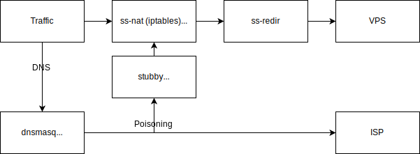

Shadowsocks Solution for Linux 透明代理解决方案
-
# 程序原理
使用CNNIC提供的chnroute中国大陆路由进行境内外出入流量分流，并使用gfwlist进行DNS污染规避。

# 程序框图



# 安装使用
## 获取脚本依赖
更新软件源列表，并安装下列程序。
```shell
sudo apt update
sudo apt install shadowsocks-libev dnsmasq stubby
```
## 下载脚本
获取脚本并授予执行权限。
```shell
wget https://github.com/SYHGroup/easy_shell/raw/master/sss/ss
wget https://github.com/SYHGroup/easy_shell/raw/master/sss/update_list
chmod +x ./ss
chmod +x ./update_list
```
## 配置环境
1. 系统配置

- （Linux桌面环境）

修改/etc/NetworkManager/NetworkManager.conf，添加如下内容以启用`dnsmasq`显式调用。
```
[main]
dns=dnsmasq
```
然后修改`update_list`配置中的`dnsmasq`参数。
```
DNSMASQ=/etc/NetworkManager/dnsmasq.d/dnsmasq_gfwlist.conf
```
- （Openwrt环境）预先安装好`smartdns`


2. 修改**可能会引起冲突**的配置
- 修改`systemd-resolved`配置，避免与Dnsmasq服务冲突。
```shell
sed -i "s/#DNSStubListener=yes/DNSStubListener=no/g" /etc/systemd/resolved.conf
systemctl restart systemd-resolved
```

- 修改`/etc/stubby/stubby.xml`端口配置，避免与Dnsmasq服务冲突。
```yaml
...
# Set the listen addresses for the stubby DAEMON. This specifies localhost IPv4
# and IPv6. It will listen on port 53 by default. Use <IP_address>@<port> to
# specify a different port
listen_addresses:
- 127.0.0.1@5453
- 0::1@5453
...
```

- 修改`/etc/stubby/stubby.xml`的TLS DNS服务器配置，加快解析速度。
```yaml
...
## Google
- address_data: 8.8.8.8
tls_auth_name: "dns.google"
- address_data: 8.8.4.4
tls_auth_name: "dns.google"
...
```

- 修改`update_list`配置
```
DNS_PORT=5453
```
这样`stubby`即可作为`dnsmasq`的上游正常工作。当然也可以使用无污染服务器提供的地址。

- 确保`/etc/resolv.conf`配置为NetworkManager调用Dnsmasq监听的地址。
```
nameserver 127.0.0.1
```

检查服务运行情况
```
sudo ss -tlnp
```
需要返回如下信息方说明正常工作，`NetworkManager(user level) -> Dnsmasq(53) -> stubby(5300)`：
```
# simonsmh @ XPS15 in ~ [15:51:09]
$ sudo ss -tlnp
State      Recv-Q     Send-Q         Local Address:Port           Peer Address:Port     Process
LISTEN     0          16                 127.0.0.1:5300                0.0.0.0:*         users:(("stubby",pid=1903,fd=4))
LISTEN     0          32                 127.0.0.1:53                  0.0.0.0:*         users:(("dnsmasq",pid=1907,fd=5))
```

3. 运行`update_list`以更新`chnroute`和`gfwlist`列表
```
sudo ./update_list
```

## 使用透明代理
脚本支持**自定义配置**，在`ss`脚本中修改
```shell
config_location=/etc/shadowsocks
systemd_service=shadowsocks-libev-redir
```
可以自行指定**系统服务名称**以及**配置位置**。

例：使用`/etc/shadowsocks/config.json`文件时，使用：
```shell
sudo ./ss config
```
停止使用
```shell
sudo ./ss config stop
```

## 维护
1. 请每周执行`update_list`以更新列表。

2. Linux桌面环境由于可以使用`NetworkManager`显式调用`dnsmasq`，请禁用`dnsmasq`的systemd服务，因此不建议开机自启。
```shell
systemctl disable dnsmasq.service --now
```

3. 如DNS缓慢，请检查`stubby`工作速度。
```shell
# simonsmh @ XPS15 in ~/Projects/easy_shell on git:master
$ dig google.com -p 5453

; <<>> DiG 9.14.9 <<>> google.com -p 5453
;; global options: +cmd
;; Got answer:
;; ->>HEADER<<- opcode: QUERY, status: NOERROR, id: 25559
;; flags: qr rd ra; QUERY: 1, ANSWER: 1, AUTHORITY: 0, ADDITIONAL: 1

;; OPT PSEUDOSECTION:
; EDNS: version: 0, flags:; udp: 512
;; QUESTION SECTION:
;google.com.                    IN      A

;; ANSWER SECTION:
google.com.             299     IN      A       172.217.26.142

;; Query time: 2505 msec
;; SERVER: 127.0.0.1#5453(127.0.0.1)
;; WHEN: 二 1月 21 22:53:50 CST 2020
;; MSG SIZE  rcvd: 65
```

4. 如代理不工作，请检查systemd日志。
```shell
# simonsmh @ XPS15 in ~ 
$ systemctl status shadowsocks-libev-redir@config.service
● shadowsocks-libev-redir@config.service - Shadowsocks-Libev Client Service Redir Mode
Loaded: loaded (/usr/lib/systemd/system/shadowsocks-libev-redir@.service; disabled; vendor preset: disabled)
Active: active (running) since Tue 2020-01-21 22:56:14 CST; 3s ago
Main PID: 11575 (ss-redir)
Tasks: 1 (limit: 19010)
Memory: 1.6M
CGroup: /system.slice/system-shadowsocks\x2dlibev\x2dredir.slice/shadowsocks-libev-redir@config.service
└─11575 /usr/bin/ss-redir -c /etc/shadowsocks/config.json

1月 21 22:56:14 XPS15 systemd[1]: Started Shadowsocks-Libev Client Service Redir Mode.
1月 21 22:56:15 XPS15 ss-redir[11575]:  2020-01-21 22:56:14 INFO: using tcp fast open
1月 21 22:56:15 XPS15 ss-redir[11575]:  2020-01-21 22:56:14 INFO: initializing ciphers... xchacha20-ietf-poly1305
1月 21 22:56:15 XPS15 ss-redir[11575]:  2020-01-21 22:56:14 INFO: listening at 127.0.0.1:1080
1月 21 22:56:15 XPS15 ss-redir[11575]:  2020-01-21 22:56:14 INFO: tcp port reuse enabled
1月 21 22:56:15 XPS15 ss-redir[11575]:  2020-01-21 22:56:15 INFO: UDP relay enabled
1月 21 22:56:15 XPS15 ss-redir[11575]:  2020-01-21 22:56:15 INFO: udp port reuse enabled
```
